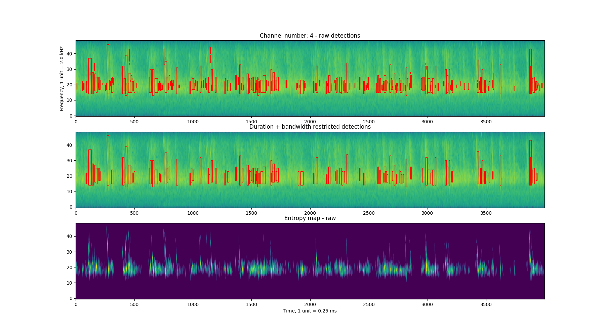

# Naive bat call detector

This bat call detector kind of does an okay job. 
The detector works through the following steps:

	* Create spectrogram visualisation of an input audio
	* Threshold spectrogram to remove background + faint sounds
	* Convolve spectrogram with a template & generate entropy map
	* Label + Segment objects in entropy map 
	* Remove potentially nonsense detections



A short example below. 
```
#%% Channel-wise parameters 
common_footprint = np.fliplr(np.eye(5))
parameters_by_channel = {}
default_channel_params = {'dynamic_range':70, 
                        'footprint':common_footprint,
                        'entropy_threshold': 0.5,
                        'NFFT' : int(fs*0.5e-3), 
                        'noverlap':int(fs*0.25e-3)}


wavfilename = os.path.split(audiofile)[-1].split('.')[0]

all_channel_detections = []
for channel_num in range(audio.shape[1]):
    periodogram_data, entmap, call_detections = specgram_batcall_detector(audio[:,channel_num],
                                                              fs, 
                                                              **parameters_by_channel[channel_num])
```