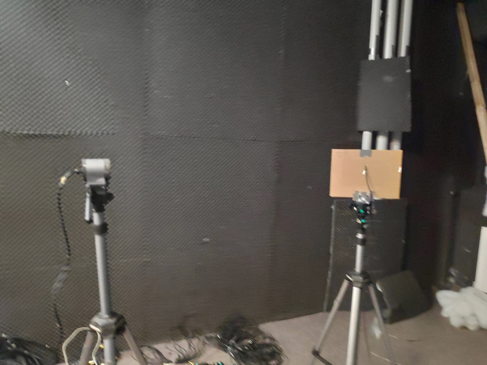
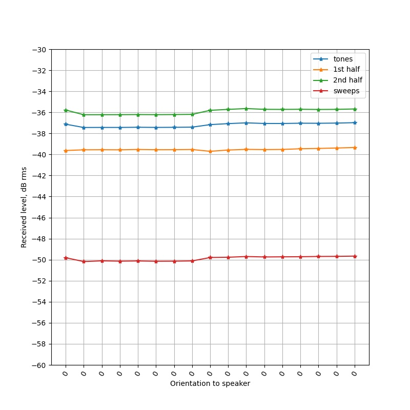

# Mic calibrations April 2021
This document will document the entire series of microphone calibrations that were start on 2021-04-15 in the 
Grossflugraum (big flight room) at Seewiesen. 

### Session 1: setting up 

### Devices used 

* Soundcard : Fireface 802 (same piece used in 2018 fieldwork). Serial number: 23746770*
* RME TotalMix (control software): FX v1.31 (2016 release)
	* The snapshot file (*.tmss) storing the channel layout, phantom power settings and gains are each stored in the dated folders. 
* Laptop : Dell Latitude E6540 (same used in 2018 fieldwork), now running Windows 10. (insti identifier nb6096)
* Speaker : Custom-built Polaroid speakers (also used in Beleyur & Goerlitz 2019 playbacks)
* Microphones : SMP Knowles mics, SANKEN CO-100 mics. 

### The setup 

Speaker and microphone were aligned with the help of a cross laser. The distance between speaker and microphone was set as close to 1m as possible without
affecting alignment too much. 

The microphone was placed on to a cardboard sheet to mimic the effect of cave walls. This was especially done for all the SMP microphones. 

The microphone is rotated around on its axis between 0-90degrees.

### Notes 2021-04-15
*Analysed on 2021-04-16* 
I noticed a drop in rec. level as I moved the SMP mic from 0-90 deg. In principle one expects this, though, given the SMP mic 
is so small - do we expect such directionality to be there? My analysis shows that the mic is indeed directional. See [this notebook](variation-in-rec-level.html).

#### Footnotes
* Number below the bar code next to the jack inputs behind